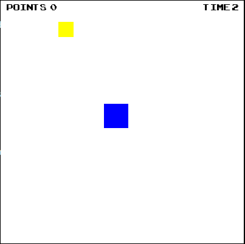

# Gold collector


The game is written entirely in Python using the Pygame library.


## Gameplay
The player controls the blue square to collect gold, which look like yellow quarts.
The player's task is to collect as much gold as possible, which must be collected within 3 seconds, otherwise the player will lose. Every time the player collects gold, the timer starts counting again from 3 seconds
In the upper left corner there is a point counter that the player has scored. In the back left corner there is a timer showing how much time is left before losing.




## Start the game
```
git clone https://github.com/KirillMikhailov442/gold-collector.git

cd gold-collector

python main.py
```
